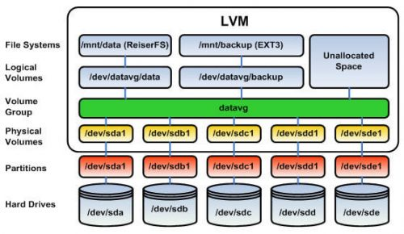

# What is LVM


[]()


[](https://gitlab.com/Blackphidora/rybook/commits/master)
## TL:DR

LVM is a way to abstract physical volumes (Disks/ Hard Drives / SSDs) from the filesystems running on top. 

The main commands are.

````
pvdisplay

pvcreate

pvmove

pvremove

vgdisplay

vgcreate

vgextend

vgreduce

lvdisplay

lvextend

lvreduce
````